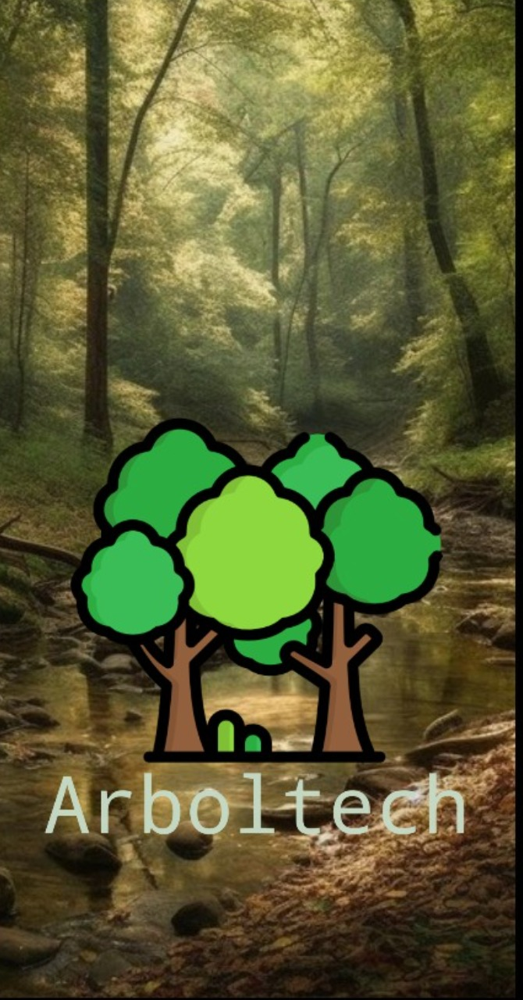
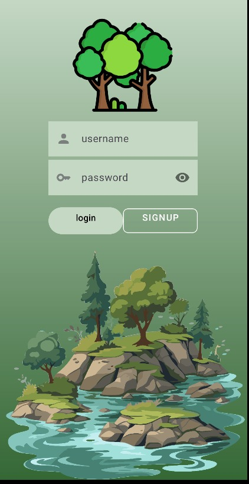
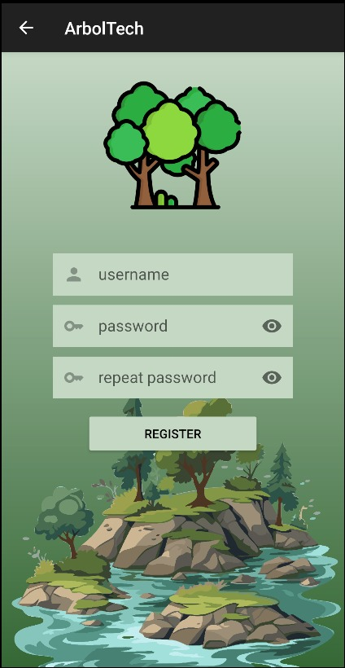
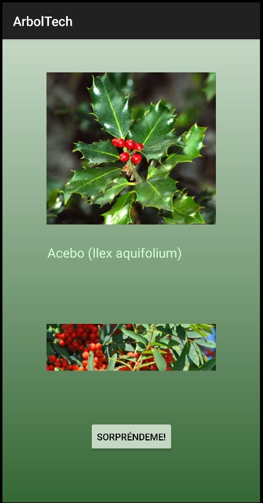

# Aplicación con Splash, Login, Register, Main y Swipe..

**-splash-**: Pantalla de entrada a la aplicacion con una imagen de fondo y una animacion del titulo de la app.

**-login**: Te puedes logear con tus credenciales y navegar con el boton login al main, y con el boton register al signUp.

**-signUp**: Aqui puedes registrarte con tus credenciales y con el boton de registrarte acceder al login para confirmar tu registro y poder acceder al main

**-main**: Podemos ver un catalogo de arboles con su imagen y nombre recogidos en un recyclerView y almacenados en una Lista. Además, existe un boton "sorprendeme" que nos va a llevar a la actividad SwipeArboles

**-SwipeArboles-**: Aqui vamos a tener una actividad con la que cada vez que refresquemos vamos a acceder a un registro de nuestra lista y se va a mostrar una imagen con un toast con su nombre.

